# KiNO!BERNIC

Онлайн-кинотеатр для портативных приставок Anbernic. Каталог, поиск, выбор
озвучки, продолжение просмотра — всё на самой приставке, без телефона рядом и
без торрентов.

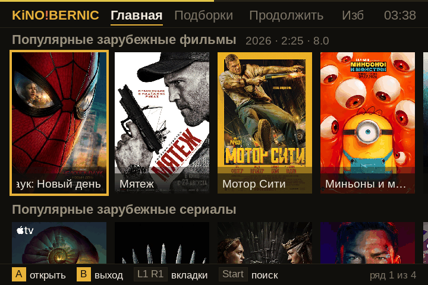

Все снимки в этом файле сняты с живой RG34XX SP — это её экран 720×480, а не
макет.

| Приставка | Система | Экран | Python |
|---|---|---|---|
| RG34XX SP | muOS `2601.0_JACARANDA` | 720×480 | 3.11.8 |
| RG35XX H | стоковая прошивка | 640×480 | 3.10.12 |

Раскладка считается от фактического размера экрана, поэтому 640×480 (RG35XX,
RG40XX, RG28XX) и 720×720 (RG CubeXX) обсчитываются тоже — но живьём эти
модели не проверялись.

## Экраны

### Главная и подборки

Четыре полки популярного и 33 тематические подборки с баннерами. Каталог
лежит на карте, поэтому листается мгновенно и без сети; обновляется он сам, в
фоне, при каждом запуске — и догружает только изменившееся, а не всё подряд.

| Подборки | Внутри подборки |
|---|---|
| 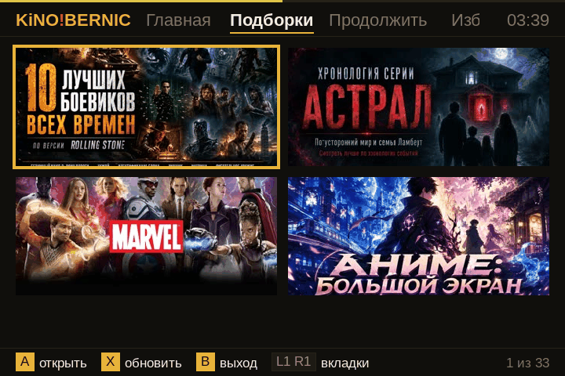 | 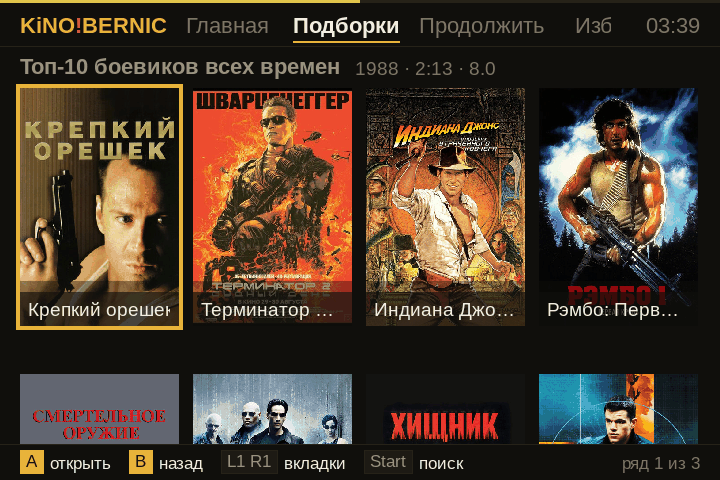 |

### Карточка

Год, хронометраж, рейтинг и описание — столько строк, сколько влезает на
экран. Если кино уже начинали, кнопка так и говорит: «Продолжить 9:04».

| Фильм | Начатое |
|---|---|
| 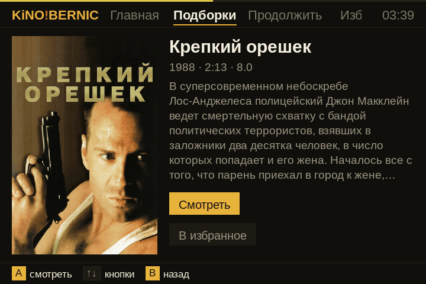 | 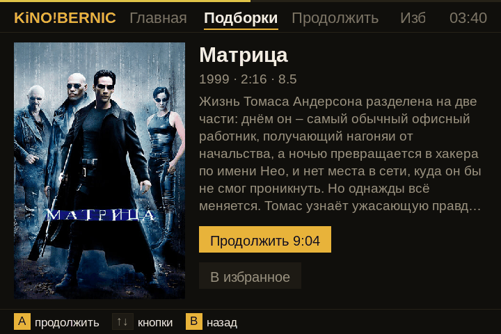 |

### Поиск

Экранная клавиатура и подсказки Кинопоиска. Найденное открывается той же
карточкой, что и всё остальное.

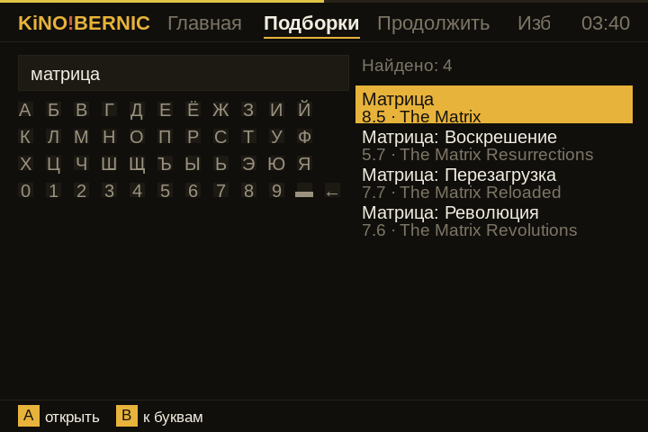

### Озвучки и серии

У «Матрицы» — **39 звуковых дорожек**: дубляж, многоголосые, авторские
переводы Гаврилова, Живова, Гланца. Список собирается из двух источников
сразу и показывается человеческими именами, а не `rus0`/`unknown`.

Выбрать можно и до запуска, и прямо во время просмотра — по кнопке Y, не
выходя из кино. Курсор при этом стоит на той дорожке, которая играет, а не на
первой.

| Перед запуском | Внутри плеера (Y) |
|---|---|
| 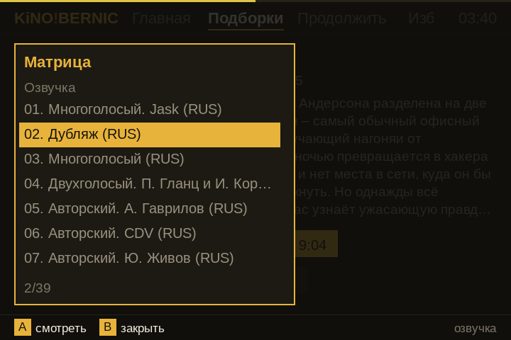 | 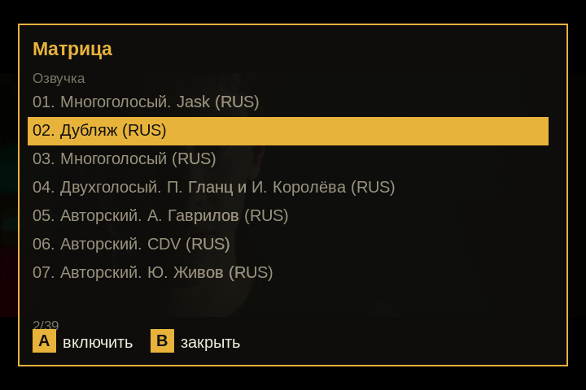 |

У сериалов рядом появляются столбцы «Сезон» и «Серия», а следующая серия
включается сама, когда текущая доиграла.

### Плеер

Играет mpv, управление и подсказки рисуются поверх видео. Заряд — в углу,
чтобы не пропустить.

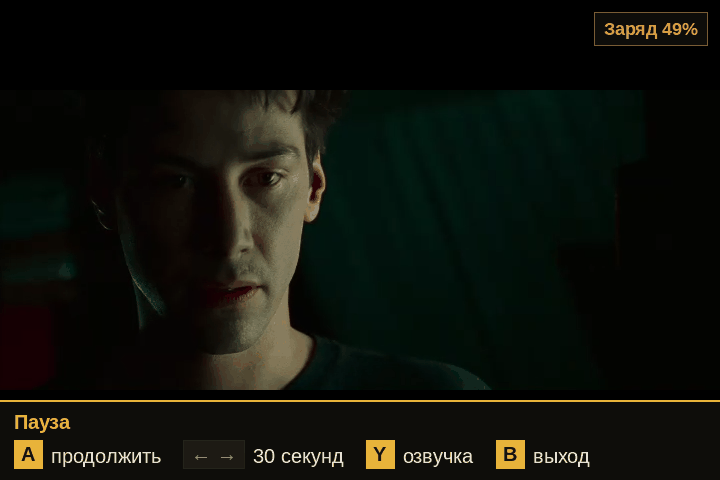

| Кнопка | Что делает |
|---|---|
| A | пауза и продолжение |
| ← → | перемотка на 30 секунд |
| Y | сезон, серия, озвучка |
| B | выход, с подтверждением |

### Продолжить

Позиция просмотра пишется по ходу дела, раз в минуту, — приставку выключают
крышкой посреди фильма, и терять из-за этого просмотр незачем.

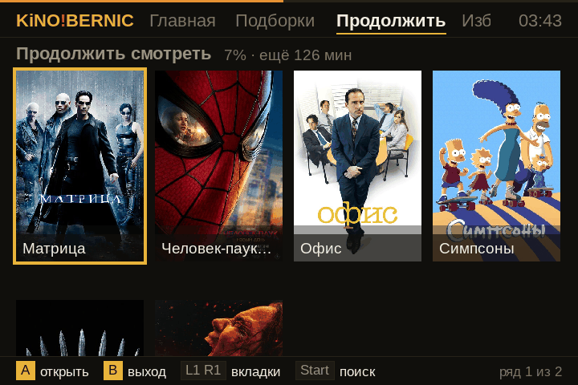

## Аккаунт

**Регистрации на приставке нет и не будет:** аккаунт требует подтверждения
почты, а открыть письмо на приставке нечем. Поэтому вход — только для уже
существующего аккаунта, а заводится он в приложении для телефона. Ссылка
«Нет аккаунта?» на экране входа ведёт ровно туда: открывает вкладку «О
приложении» и сразу показывает код со ссылкой на APK.

| Вход | Аккаунт подключён |
|---|---|
| 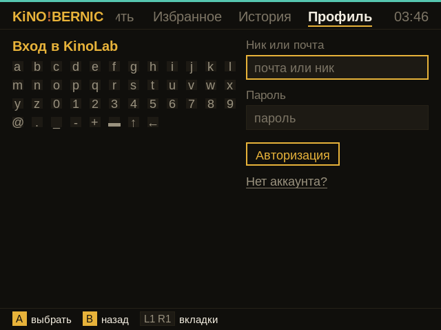 | 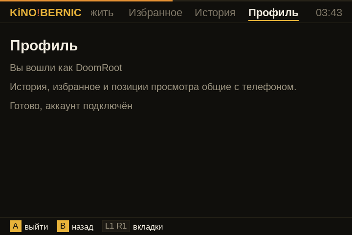 |

*Слева — экран RG35XX H (640×480), там аккаунт ещё не привязан.*

Вход по нику или почте. Раскладка на экране входа своя, без кириллицы:
почта и пароль её не содержат, зато нужны знаки. Клавиша ↑ переключает
второй набор со знаками и заглавными.

**Что становится общим с телефоном и ноутбуком:** «Продолжить», «Избранное» и
«Вы смотрели». Приставка не только читает эти списки, но и пополняет их —
позиция просмотра уходит в аккаунт, досмотренное снимается сразу на всех
устройствах.

Правила отметок одинаковые со всеми клиентами, иначе списки разъезжаются:

| Событие | Порог |
|---|---|
| отметка сохраняется | с 5-й секунды |
| «Продолжить» предлагает вернуться | с 10-й секунды |
| просмотр считается досмотренным | не раньше минуты, дальше 95 % или последние 3 минуты |

**Без аккаунта тоже работает.** Позиция просмотра всегда пишется на карту, в
`positions.json`, и вкладка «Продолжить» наполняется из неё. Аккаунт нужен
ровно для того, чтобы список был общим с другими устройствами.

Токен лежит на карте открытым текстом. Это не защита, а честность: карта
вынимается и читается на любом компьютере, и кто держит карту — держит
аккаунт.

## Обновления

Приложение проверяет и ставит обновления само.

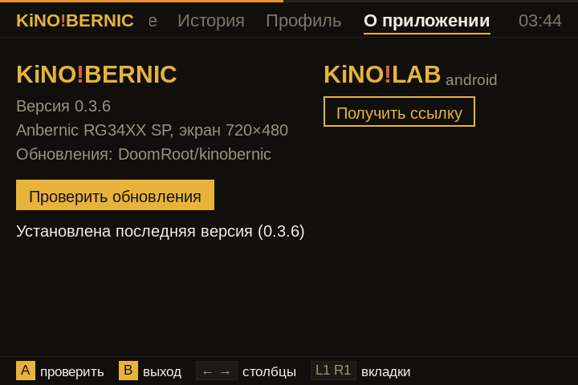

Манифест `update.json` читается по списку зеркал — первое ответившее
выигрывает, потому что GitHub открывается не у всех. Приложение скачивает
`.muxapp`, проверяет архив и выходит с кодом 36; разворачивает его запускалка,
когда python уже закрыт — менять файлы работающего приложения плохая идея.
Весь цикл от нажатия до новой версии на экране занимает около десяти секунд.

## Андроид-версия

Вкладка «О приложении» умеет показать ссылку на APK телефонной версии кодом
на экране — наводишь камеру и скачиваешь. Отсюда же заводится аккаунт.

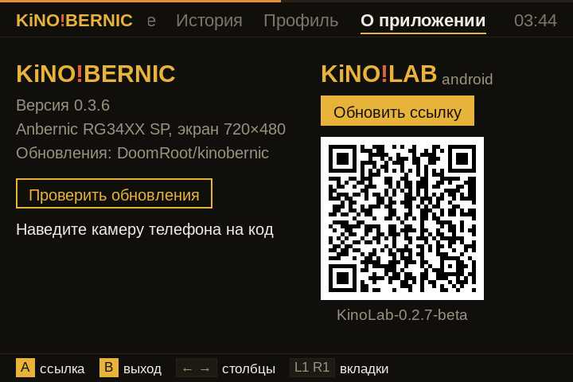

## Установка

**Проще всего — установщиком для компьютера.** Вставить карту приставки в
картридер, запустить `Установить KiNO!BERNIC.bat` из релиза: он сам найдёт
карту, определит прошивку и разложит файлы. Умеет и по сети, если на приставке
включён SSH, и удалять — с данными или без. Подробности:
[tools/installer/README.md](tools/installer/README.md).

**Вручную.** Распаковать `*-install.zip`, открыть папку своей прошивки (`muos`
или `stock`) и скопировать её содержимое в корень карты. Запуск: на muOS —
**Приложения → KiNO!BERNIC**, на стоковой прошивке — раздел **APPS**.

**На muOS ещё и через Менеджер архивов.** Положить `.muxapp` из релиза в папку
`ARCHIVE` на карте, дальше «Приложения → Менеджер архивов» и кнопка A.

Каталог собирается при первом запуске, на самой приставке: главная готова
меньше чем за минуту, витрина подборок следом, содержимое подборок докачивается
фоном — листать можно сразу.

## Как устроено

Компилятора на приставке нет, pygame тоже нет, зато есть Python и SDL2 2.28 с
`ttf` и `image`. Поэтому всё написано на Python поверх SDL2 через `ctypes` —
собирать нечего, файлы просто копируются на карту. Экраны, разметка под три
размера экрана, чтение геймпада через evdev, свой OSD поверх видео, разбор
источников и сборка каталога — всё своё.

Видео играет mpv, запущенный отдельным процессом; приложение управляет им по
IPC и рисует поверх собственные подсказки и меню.

Байткод привязан к версии интерпретатора, а на приставках стоят разные Python
(3.10 на стоковой прошивке и 3.11 на muOS), поэтому в релизе лежат оба набора,
а запускалка выбирает свой по `sys.version_info`.

Исходники приложения пока не опубликованы. В этом репозитории — то, что нужно
для установки и обновления: установщик для компьютера, манифест обновлений и
это описание.

## Управление

| Кнопка | Каталог | Плеер |
|---|---|---|
| крестовина | навигация | перемотка ← → на 30 секунд |
| A | открыть / выбрать | пауза |
| B | назад / выход | выход (с подтверждением) |
| X | пересобрать каталог (на «Подборках») | — |
| Y | — | сезоны, серии и озвучки |
| L1 R1 | вкладки | скрыть подсказки |
| START | поиск | — |

Коды кнопок сняты нажатиями на обеих приставках и совпадают: A 304, B 305,
X 307, Y 306, L1 308, R1 309, SELECT 310, START 311.
